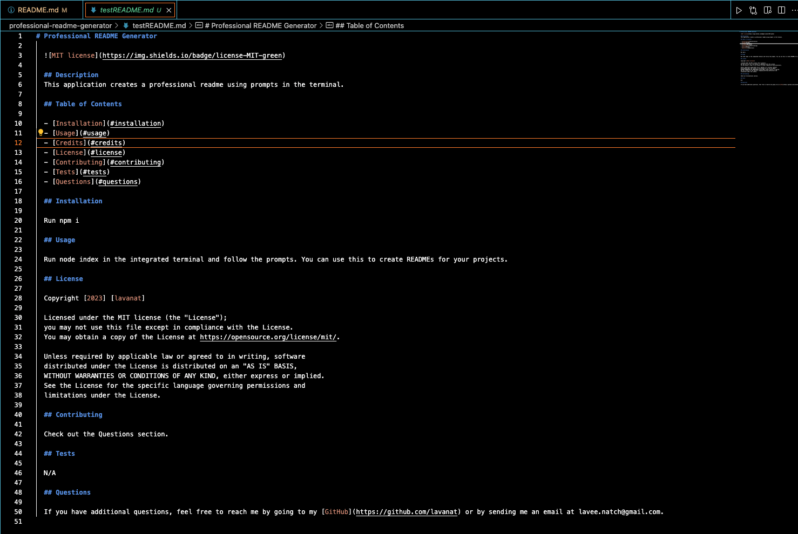
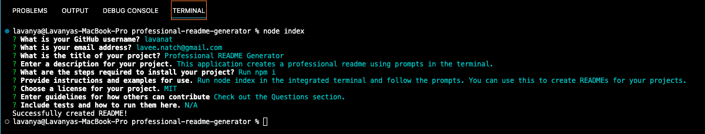

# Professional README Generator
Automatically generate a professional README using prompts in the terminal

## Description

Users are presented with a list of questions in the terminal to generate a professional README. This was created using Node.js

## Usage

You can use this application to generate a professional README.

## Link to Video Walkthrough

[Video Walkthrough](https://drive.google.com/file/d/1g9P2P_Hw6hPuxElO6AO9ODkU-AVGp6Ik/view?usp=sharing)

## Link to Example Generated README

[Test README](./assets/testREADME.md)

## Screenshot of Application

